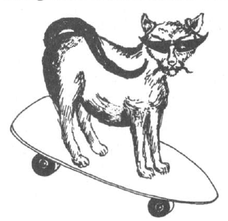

### 🐌 「知られざる呪術師」による注釈

>- あれやこれや1
>- あれやこれや2
>- あれやこれや3

---

## 🇯🇵 機能精霊(Functional Spirits)

召喚魔術のひとつのアプローチとして、「特定の状況や目的に由来する精霊たち」と協働するという方法がある。

たとえば『ソロモン王の小さな鍵（The Lesser Key of Solomon the King）』のようなグリモワール（魔術書）には、こうした精霊についての詳細な記録が残されている。精霊の典型的な姿、名前、シジル（印章）、召喚の手順などが、手引書のようにまとめられているのだ。

『小さな鍵』に登場する精霊たちは、奇妙な名前と、しばしばそれ以上に奇妙な外見を持っている。にもかかわらず、彼らが持つ力は意外にも実用的で、極めて役立つ。

たとえば RAUM（ラウム）という存在は、黒い鳥の姿で現れ、次のような能力を持つとされる：

- 愛を生み出す

- 敵を和解させる

- 都市や名声を破壊する

これらの精霊を召喚する伝統的な方法は、古来の儀式的魔術（タイムオナー・マジック）に従うことである。
この方法では、精霊を三角形（トライアングル）の中に呼び出し、儀式的に魔術師の意志に従わせる（束縛する）。

……が、実はそれとは別のアプローチもある。
つまり、**「適切な状況にあるときに、即興的に精霊を召喚する」**という方法だ。

以下の例は、そのような召喚法を示すものである：

誰でも一度は経験があるだろう──
渋滞や交通の停滞に巻き込まれてイライラする瞬間。
高速道路での大渋滞から、トロトロ歩く人の列にまで……。

「こんなとき、すっと動けるようにしてくれる精霊を呼び出せたらどんなにいいだろう？」

さあ皆さん、拍手でお迎えください──
交通の滞りを解消してくれる精霊、GOFLOWOLFOG（ゴフロウルフォグ）！

GOFLOWOLFOGは通常、サングラスをかけたスケボーに乗った猫の姿で現れる。
彼は風を連れてきて、「ニーィィィーーオォォゥ」というような音を響かせる。

  

その性質はクールでスタイリッシュ、非常に洗練されている。

GOFLOWOLFOG は、彼の管轄下にある状況において召喚することができる。
たとえば──熱波のさなかに超満員の電車に閉じ込められていて、しかもその電車が「SNAFU原則」（※何もかもが常にうまくいかない）に則って完全に停止し、再び動く気配がない……そんな状況がぴったりだ。

そんなときは、「ニーィィィーーオォォゥ」という音に耳をすませてみよう。
そして、スケボーであなたの横をすり抜けていく GOFLOWOLFOG の姿を目撃するのだ。
彼が去ったあとには、風のような感覚の残像が残るだろう。

……たとえ何も起こらなかったとしても、この召喚行為そのものが、ストレス源からあなたの意識を引きはがしてくれる。
──たとえば、暑さで溶けかけながら「この隣の爆音ラジカセ野郎を◯してやろうか」と考えるような状況からね。

精霊があなたの前をスーッと滑っていくのを見たら、彼の注意を引くために、（内面だけでも）自分自身を彼と同じくらい“クールでスタイリッシュなやつ”に変身させよう。
そして、しばしの間、自分が GOFLOWOLFOG と一緒にスケボーに乗って、渋滞をすり抜けていく様子を視覚化する。

……そうしたら、その「ヴィジョン」をそっと手放し、リラックスして精霊に仕事を任せるのだ。

もしもあなたが GOFLOWOLFOG を召喚して、交通の流れを良くしてもらったなら──
たとえ数メートルしか動けなかったとしても──
それに対して何かしらのお返しをするのが礼儀というものだ。

精霊に対する謝礼の方法はいろいろあるが、GOFLOWOLFOG が特に喜ぶものは次のふたつ：

他人にスペースを与えること。
　──急いでいる誰かに道を譲ったり、車の運転中に割り込みたい車にスペースを作ってあげるなど。

次に出会った猫にやさしくすること。

では、GOFLOWOLFOG はどこから来たのか？

彼はロンドンで開催された魔術セミナーの最中に“発見”され、設計・構築された存在である。
その晩、イギリスは熱波に見舞われており、参加者全員が会場までの交通に問題を抱えていた。

GOFLOWOLFOG の設計プロセスは以下の通りである──

1. 一般的な状況：交通（トラフィック）

2. 状況に対応した機能：交通の停滞を解消する

3. 精霊の命名：いくつかの候補の中から「GO FLOW（進め、流れよ）」が選ばれた。
　この名前に**呪文的な響き（バーバリック感）**を加えるために、文字列を反転させて「GOFLOWOLFOG」となった。

4. 精霊の姿：
　車輪や信号機など、いくつかの形状案が出されたが、
　最終的にはスケートボードに乗った猫のイメージが選ばれた。
　これは記憶に残りやすく、またグリモワールに登場する奇妙で不条理な精霊の外見にも通じるものがあるためである。

5. 精霊の性質・気質（Disposition or Character）：
　Goflowolfog の性格については、**「クール」「スタイリッシュ」「リラックスしている」「素早く」「しなやか」**である以外には考えられない、ということで意見が一致した。
　彼は、交通渋滞のような苛立たしい状況においても、こうした性質を少しでも体現しようとする者には、好意的に応えてくれる──と考えられている。

　また、彼の動きと結びつけられた音（ニーィィィーーオォォゥ）は、彼を呼び寄せるマントラとして機能する。
　円の中に互いに逆向きの矢印を描いたシジルもまた、護符（タリスマン）として使うことができる。
　このシジルは車や自転車など、さまざまな交通手段に貼りつけて、Goflowolfog の加護を得るために使ったり、召喚時の焦点としても活用できる。

このプロセスを活用すれば、あなた自身の“役立つ精霊のグリモワール”を簡単に作ることができる。

友人たちと一緒にこうした精霊を設計してみるのも、非常に興味深く、そして楽しい体験になるだろう。
多くの人々によって“組み立てられた”精霊は、それぞれ異なるやり方で使われていくことになる。
そして、その精霊の使用報告が多く集まり、成功例が増えるほど、精霊への“信頼（confidence）”が強まっていく。

さらに時間が経ち、使用が広まっていけば──
その精霊のイメージが文化的ミーム・プールの中に入り込んでいく可能性すらあるのだ。

もしも将来、《ナショナル・エンクワイアラー》や《フォーティアン・タイムズ》に
「スケートボードに乗った猫が目撃された」という記事が載っていたら──
どうかGoflowolfog のことを思い出してほしい！

  

---

🇬🇧 原文を表示（別ファイルで開く）

🔗 [原文を読む 05_functional_spirits_en.md](05_functional_spirits_en.md)

---

© 2025 知られざる呪術師（Le Sorcier Inconnu）
本ドキュメントは Creative Commons BY-SA 4.0 に基づき公開されています。
