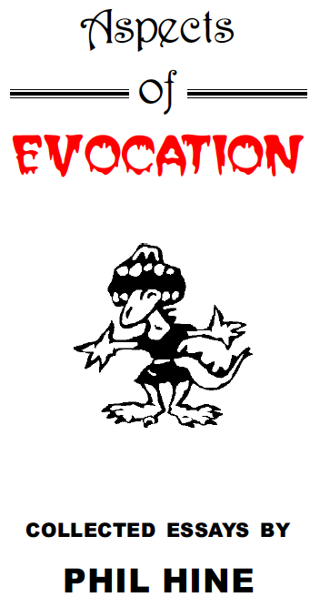
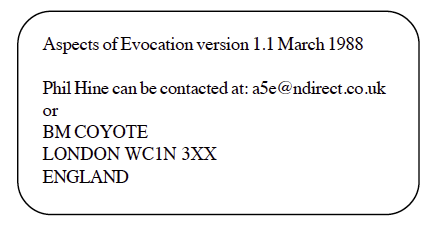

# 🧙‍♂️ Aspects of Evocation - 翻訳＋注釈（制作途中）

**魔術書を「読む」のではなく、「使う」ために**  
**フィル・ハイン（Phil Hine）による実践の書を翻訳・注釈し、日本語で魔術の回路をひらくZineです**  
**儀式、身体、そして想像力──すべてをテストするプロジェクトへようこそ**  

**by 知られざる呪術師（*Le Sorcier Inconnu*）**

ディスコーディアン暦3191年 交差する道の祝日 第9火曜日 
――静かに歩むシャーマンのために、銀の葉🍃が舞い降りる日

---

 

---

## 📚 目次

| タイトル | 内容概要 | リンク |
|------------|-----------|------------------|
| 1. 序文（Introduction） | 喚起魔術の出発点と著者の立場 | [👉](01_introduction.md) |
| 2. ハウリング（Howling） | 内的悪魔との対話、変容の儀式 | [👉](02_howling.md) |
| 3. サーヴィター（Servitors） | サーヴィター創造と実践ガイド | [👉](03_servitors.md) |
| 4. GoHuサーヴィター（GoHu Servitor） | 噂の魔術的活用とユーモア | [👉](04_gohu_servitor.md) |
| 5. 機能精霊（Functional Spirits） | 日常における即興的エヴォケーション | [👉](05_functional_spirits.md) |
| 6. ゴエティア・プロジェクト（Goetia Project） | 伝統魔術の検証と実験記録 | [👉](06_goetia_project.md) |
| 7. ヨグ＝ソトースの召喚（Evoking Yog-Sothoth） | クトゥルー神話との接続と現代魔術理論 | [👉](07_evoking_yog_sothoth.md) |

---

## 📄 この文書について

本Zine『Aspects of Evocation ― フィル・ハイン著作 翻訳＋注釈』は、英国の現代魔術作家 Phil Hine によるエッセイ集 Aspects of Evocation の全章を対象に、翻訳・再解釈・注釈を加えた日本語版です。

原文は1990年代にZee-CDプロジェクトやサークル・オブ・スターズ（Circle of Stars）、Esoteric Order of Dagon の文脈で発表されたものであり、現在オンライン上にて非商用目的で広く共有されています。作者本人による明確な著作権表示は確認されていませんが、その実践的スタンスと公開形式をふまえ、本Zineは 文化的再構築（cultural reconstruction） として制作されています。

翻訳・注釈・レイアウト・編集は日本の魔術研究者 知られざる呪術師（Le Sorcier Inconnu） によるものであり、原文の精神を尊重しつつも、新たな文脈での応答として仕上げられています。

この文書全体（翻訳文、注釈、章構成、編集デザイン）は Creative Commons BY-SA 4.0 に基づいて公開されており、著作権的に問題がない形で二次創作・共有・改変が可能です。

魔術書を読むのではなく、「使う」ために――
そして見えないものたちに、呼びかけの言葉を。
このZineは、儀式の輪の外にいるすべての読者に開かれています。

---

## 📦 原文のライセンスと出典について

Credits & Acknowledgements
Firstly to Arawyn, for bugging me to put something together
for the Zee-CD project. Also to Stephen Sennitt, editor of Nox
magazine for much encouragement, to the members of Circle of
Stars, the Esoteric Order of Dagon and finally to Fra. GosaA for all
those evenings spent standing in a circle made out of masking
tape!

 

---

## 🔗 関連リンク

- [Phil Hine公式サイト](http://www.philhine.org.uk/)
- [フィル・ハイン著『現代シャーマニズムの技法 第1巻』への注釈Zine](https://github.com/ravensgate-tux/hine_modern_shamanism)
- [グラント・モリスン著『Pop Magic』への注釈Zine](https://github.com/ravensgate-tux/pop_magic_translation)
- [グラント・モリスン『BATMAN R.I.P.』から読み解く「深淵」と「降下」Zine](https://github.com/ravensgate-tux/batman_rip_zine/blob/main/README.md)

----

© 2025 知られざる呪術師（Le Sorcier Inconnu）
本ドキュメントは Creative Commons BY-SA 4.0 に基づき公開されています。
